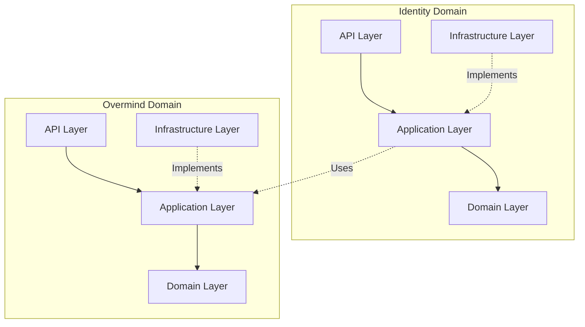

# Domain Model & System Boundaries

This document defines the high-level architecture of Cogniforge, dividing the system into distinct **Domains** (Areas of Responsibility) and **Layers** (Technical concerns).

## 1. Domain Map

The system is divided into four primary domains. Each domain represents a distinct business capability.

| Domain | Description | Key Responsibilities |
| :--- | :--- | :--- |
| **1. Identity & Access (IAM)** | User Management & Security | • Authentication (Login/Register) • Authorization (RBAC, Policies) • Session Management (JWT) • User Profiles |
| **2. Cogniforge Core (Reality)** | Core Business Logic | • Project Management • File Operations (Analysis/Transformation) • Chat History & Persistence • Subscription/Billing Logic |
| **3. Overmind Intelligence** | AI Orchestration | • LLM Gateway (Neural Routing Mesh) • Agent Orchestration • Planning & Reasoning (Deep Indexing) • Tool Execution |
| **4. Infrastructure (Platform)** | Technical Foundation | • Database Access (SQLAlchemy) • Configuration (Settings) • Observability (Logging/Metrics) • External Integrations (Git, Cloud) |

---

## 2. Layered Architecture (Per Domain)

Within each Domain, we enforce a strict 4-layer architecture to ensure Separation of Concerns (SoC).

### Layer 1: API (Interface)
*   **Purpose:** Handle external interaction (HTTP, CLI, WebSocket).
*   **Components:** FastAPI Routers, Pydantic Request/Response Schemas, CLI Handlers.
*   **Rule:** logic here should be limited to parsing input and formatting output. No business rules.

### Layer 2: Application (Use Cases)
*   **Purpose:** Orchestrate business flows.
*   **Components:** Services, Orchestrators, Use Case classes.
*   **Rule:** Coordinates the *Domain* and *Infrastructure* to achieve a user goal. Does not know about HTTP.

### Layer 3: Domain (Core)
*   **Purpose:** Pure business logic and state definition.
*   **Components:** Entities (Models), Value Objects, Domain Services/Rules.
*   **Rule:** Pure Python. No dependencies on frameworks (FastAPI) or Infrastructure (DB drivers).

### Layer 4: Infrastructure (Implementation)
*   **Purpose:** Implement interfaces defined by inner layers.
*   **Components:** Repositories (SQL), AI Clients (OpenAI/Anthropic), File System Adapters.
*   **Rule:** The only layer allowed to touch "dirty" external systems (IO).

---

## 3. Visual Reference

