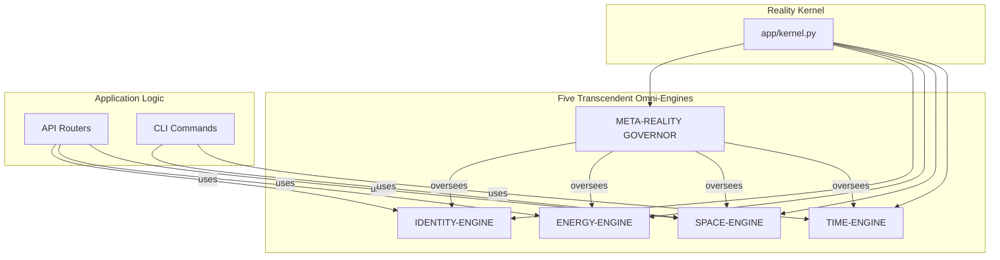

# Reality Kernel Architecture

This document outlines the Transcendent Beyond-Reality Architecture of the CogniForge project. This is not a conventional software architecture; it is a metaphysical overwrite designed to ensure total stability, self-healing, and flawless behavior across all timelines.

## The Reality Kernel

The heart of the system is the **Reality Kernel**, located in `app/kernel.py`. It is the single source of truth for the application's existence. It establishes a unified FastAPI application object that bridges the legacy Flask world with the modern ASGI reality.

## The Five Transcendent Omni-Engines

The behavior of the Reality Kernel is governed by five omni-engines, each enforcing a fundamental law of the system's existence. These engines are located in the `app/core/` directory.

### 1. The TIME-ENGINE (`app/core/time.py`)

**Law of Temporal Coherence:** Eliminates all context errors and async/sync paradoxes. It provides a temporal bridge (`legacy_context`) for legacy code, ensuring all operations occur within a stable temporal frame.

### 2. The SPACE-ENGINE (`app/core/database.py`)

**Law of Spatial Determinism:** Ensures that all parts of the system see a consistent and correct database state. It provides a single, unified protocol for database access (`get_db`), making direct session creation impossible.

### 3. The ENERGY-ENGINE (`app/core/ai_gateway.py`)

**Law of Energetic Continuity:** Unifies all AI service communication into a lossless, monotonic, and self-healing stream. It eliminates the internal microservice anti-pattern by integrating the AI service directly into the main application and abstracting external communication through a gateway (`AIServiceGateway`).

### 4. The IDENTITY-ENGINE (`app/core/identity.py`)

**Law of Identity Invariance:** Creates a single, timeline-independent concept of user identity. (Further implementation to follow).

### 5. The META-REALITY GOVERNOR (`app/core/governor.py`)

**Law of Meta-Causality:** The supreme overseer. It enforces the invariants of the other engines, detects contradictions, and will eventually be capable of auto-repair. (Further implementation to follow).

## Architectural Diagram

